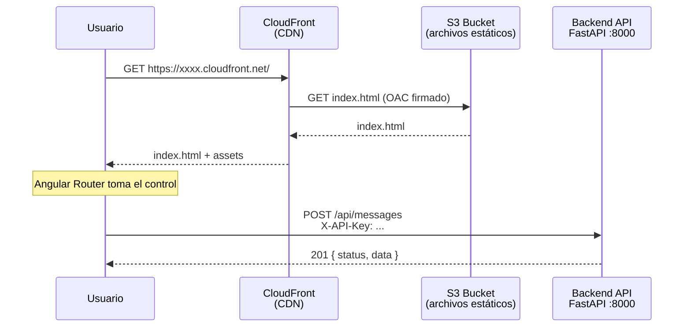
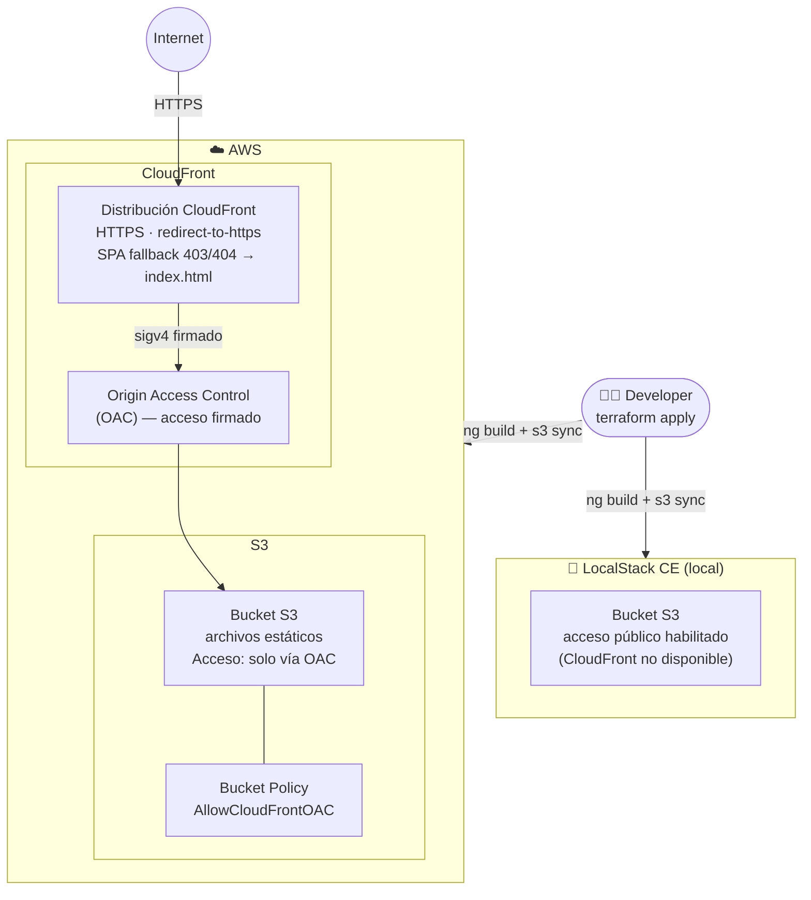
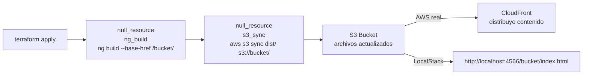

# Nequi Chat — Frontend

Aplicación SPA construida con **Angular 21**, desplegable en AWS con S3 + CloudFront o localmente con Docker / LocalStack.

## Stack

| Componente | Tecnología |
|---|---|
| Framework | Angular 21 |
| Lenguaje | TypeScript |
| Estilos | SCSS |
| Pruebas | Vitest |
| Contenedor | Docker + Nginx |
| Infra | Terraform + S3 + CloudFront |

---

## Arquitectura

### Flujo de una request



### Infraestructura AWS (Terraform)



### Pipeline de deploy (Terraform automatizado)



---

## Inicio rápido con Docker

La forma más rápida sin necesitar AWS ni Terraform:

```bash
# Desde la raíz del proyecto
docker compose up --build
```

| Servicio | URL |
|---|---|
| Frontend | http://localhost:8080 |
| Backend  | http://localhost:8000 |

---

## Desarrollo local (ng serve)

```bash
npm install
ng serve
# http://localhost:4200
```

---

## Pruebas

```bash
# Unitarias
ng test

# Con cobertura
ng test --coverage
# Resultado en: coverage/index.html
```

---

## Infraestructura con Terraform

```
terraform/
├── main.tf                   # Provider AWS + null + soporte LocalStack
├── variables.tf              # Variables configurables
├── s3.tf                     # Bucket S3 + ng build automático + s3 sync
├── cloudfront.tf             # OAC + Distribución CloudFront (omitido en LocalStack CE)
├── outputs.tf                # frontend_url, cloudfront_domain…
├── terraform.tfvars.example  # Plantilla de variables
└── .gitignore                # Excluye estado y secretos
```

> **CloudFront** no está disponible en LocalStack CE. En local, los archivos se sirven directamente desde S3 con acceso público.

### Con LocalStack (sin cuenta AWS)

```bash
# Levantar LocalStack desde la raíz
docker compose -f ../docker-compose.localstack.yml up -d

cd terraform
cp terraform.tfvars.example terraform.tfvars
terraform init
terraform apply -var="use_localstack=true"

terraform output frontend_url
# http://localhost:4566/reto-nequi-dev-frontend/index.html
```

### Con AWS real

```bash
export AWS_ACCESS_KEY_ID=...
export AWS_SECRET_ACCESS_KEY=...

cd terraform
cp terraform.tfvars.example terraform.tfvars
terraform init
terraform apply

terraform output frontend_url
# https://xxxx.cloudfront.net
```

### Variables de Terraform

| Variable | Por defecto | Descripción |
|---|---|---|
| `frontend_src_dir` | `..` | Raíz del frontend (donde está `package.json`) |
| `build_dir` | `../dist/frontend/browser` | Directorio del build de Angular |
| `base_href` | `""` (auto) | Base href de la SPA — calculado automáticamente |
| `use_localstack` | `false` | `true` para LocalStack, `false` para AWS real |
| `cloudfront_price_class` | `PriceClass_100` | US + Europa (más económico) |


